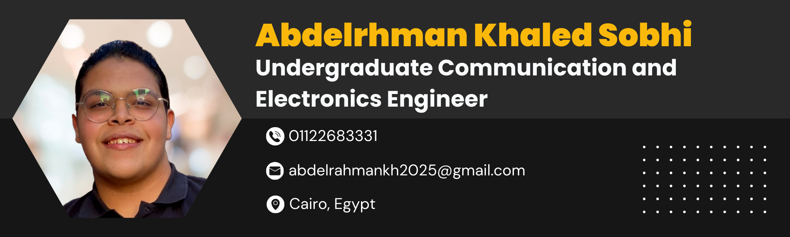

<h1 align="center">Hi 👋, I'm Abdelrahman Khaled</h1>
<h3 align="center">A passionate Communication and Electronics Engineer</h3>

I am an undergraduate student pursuing a degree in communication and computer engineering at Benha University.
My academic journey has sparkle a passion for embedded systems, with a particular focus on embedded applications, automotive technology, and telecommunications

 
<!--   -->

  
  
  
  
  
 

 

<!--

 

-->

  

- Currently working as **R&D Hardware Design Engineer**

- I’m currently learning **Hardware Design, Embedded Systems, and IoT/IIoT**

- Ask me about **C, Cpp, Python, and Javascript**

- How to reach me **abdelrahmankh2025@gmail.com**

 

<h3 align="left">Connect with me:</h3>

 

<h3 align="left">Skills and Tools:</h3>

- Embedded Systems

  

- Frontend

  

- Tools

  

 

  

